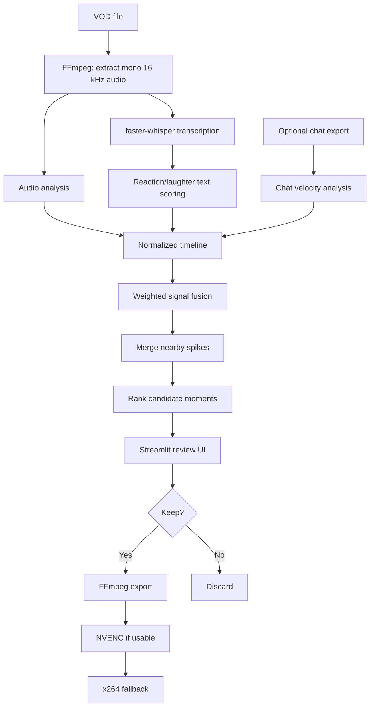

# ⛏️ HighlightMiner

**Local-first VOD highlight detection for streamers and long-form recordings.**

HighlightMiner scans a VOD, combines audio spikes, speech/reaction cues, and optional chat bursts, then produces a ranked review queue. You decide what is actually worth keeping and export selected moments as MP4 clips.

> **Status:** early MVP / v0.1.x. Useful, hackable, and intentionally simple. It is not yet a full gameplay-understanding AI editor.

## Why this exists

Manually scrubbing a multi-hour stream to find the 30 seconds where everything went spectacularly wrong is a terrible use of a human lifespan.

HighlightMiner does the cheap work first:

1. Extract low-cost audio features.
2. Transcribe speech locally with `faster-whisper`.
3. Score reaction-heavy transcript segments.
4. Optionally measure chat-message bursts.
5. Merge those signals into candidate highlight windows.
6. Let a human review the ranked list in a local browser UI.
7. Export only the clips you mark **Keep**.

No cloud API is required for v0.1.

---

## Features

- **Local VOD analysis** — your video is processed on your own machine.
- **GPU Whisper support** — uses `faster-whisper`/CTranslate2 when CUDA is available, with CPU fallback.
- **Portable FFmpeg support** — use `ffmpeg`/`ffprobe` from `./bin`, the project root, or system `PATH`.
- **Audio excitement scoring** — finds unusually loud/energetic moments and sudden changes.
- **Transcript heuristics** — reactions, laughter, profanity, emphatic wording, and configurable phrases.
- **Optional chat-burst scoring** — JSON, JSONL/NDJSON, or CSV.
- **Signal fusion** — audio + transcript + chat are weighted rather than treated as independent clip generators.
- **Context-aware candidate windows** — pre-roll/post-roll keeps the setup before the punchline.
- **Local Streamlit review UI** — preview, Keep/Reject, adjust timing, and title clips.
- **Accurate clip export** — selected clips are re-encoded instead of depending on source keyframes.
- **NVENC-first export** — attempts `h264_nvenc` when available and falls back to `libx264`.
- **Cached analysis artifacts** — expensive transcription is reused when possible.

---

## How it works



### Default score weighting

From `settings.json`:

```json
{
  "weights": {
    "audio": 0.34,
    "transcript": 0.42,
    "chat": 0.24
  }
}
```

If no chat file is supplied, the remaining weights are automatically renormalized.

The score is **not** meant to answer “is this objectively funny?” — thankfully we have not yet invented that particular dystopia. It ranks moments that look promising so a human can review far less footage.

---

## Recommended Twitch input workflow

For Twitch VODs, the **recommended workflow during current HighlightMiner testing is to use [TwitchDownloader](https://github.com/lay295/TwitchDownloader) to obtain both the VOD and its matching chat export**.

This gives different HighlightMiner users a much more consistent pair of source files and makes bug reports/reproduction easier than mixing VODs and chat from unrelated downloaders/exporters.

TwitchDownloader can download Twitch VODs and export the corresponding VOD chat as JSON. Its Windows GUI and cross-platform CLI both support the core download workflow.

### Recommended files

For each Twitch stream, obtain:

```text
stream.mp4
stream_chat.json
```

Then provide both local files to HighlightMiner:

```text
TwitchDownloader
├── VOD download      → stream.mp4
└── Chat JSON export  → stream_chat.json
                         │
                         ▼
                  HighlightMiner
```

**Use the original JSON chat export**, not a rendered chat video. HighlightMiner wants timestamped message data so it can calculate chat velocity/bursts.

TwitchDownloader releases:

- https://github.com/lay295/TwitchDownloader/releases

Project/documentation:

- https://github.com/lay295/TwitchDownloader

### Why recommend one downloader?

HighlightMiner's chat parser is intentionally permissive, and direct local VODs plus JSON/JSONL/CSV chat remain supported. However, using TwitchDownloader for Twitch input gives us a common baseline while the project is young:

- VOD and chat come from the same Twitch source.
- Chat timestamps are tied to the VOD timeline.
- Users can reproduce one another's setup more easily.
- Parser bugs are easier to diagnose when everyone is not using a different exporter invented in a shed.

TwitchDownloader is **not bundled, imported, or automatically invoked by HighlightMiner**. It is a recommended companion tool.

A future version may optionally integrate **TwitchDownloaderCLI** so a user can paste a VOD ID/URL and have HighlightMiner obtain the VOD + chat automatically. That is deliberately being left for later, after the core scrubber has survived real-world testing.

### Thank you

A specific thank you to **[lay295](https://github.com/lay295) and the TwitchDownloader contributors** for building and maintaining TwitchDownloader. HighlightMiner can focus on highlight detection instead of badly reinventing Twitch downloading because that problem already has a mature open-source solution.

---

## Requirements

### Required

- Windows, Linux, or macOS should work in principle; the convenience scripts target Windows.
- Python **3.10+**
- FFmpeg + ffprobe, found using one of the supported lookup locations below.

### FFmpeg / ffprobe versions and downloads

HighlightMiner does **not currently enforce one exact FFmpeg version**. It uses long-established FFmpeg/ffprobe CLI features for probing media, extracting PCM audio, checking encoders, and exporting clips.

For Windows there are two sensible routes:

1. **Current/recent FFmpeg build — recommended for new installs**
   - Official FFmpeg download page: https://ffmpeg.org/download.html
   - FFmpeg's Windows section links to maintained compiled builds such as:
     - gyan.dev: https://www.gyan.dev/ffmpeg/builds/
     - BtbN: https://github.com/BtbN/FFmpeg-Builds/releases

2. **Known-good static build used during HighlightMiner testing**
   - DescriptInc `ffmpeg-ffprobe-static` release `b6.1.2-rc.1`:
     https://github.com/descriptinc/ffmpeg-ffprobe-static/releases/tag/b6.1.2-rc.1
   - This release provides separate Windows x64 FFmpeg and ffprobe binaries.
   - The tested setup places them in the HighlightMiner project root as `ffmpeg.exe` and `ffprobe.exe`.

> **Important:** use `ffmpeg` and `ffprobe` from the **same build/release**. Do not mix an FFmpeg binary from one distribution with an unrelated ffprobe binary unless you have a specific reason to do so.

The DescriptInc build above is documented as **tested**, not as a required forever-version. Newer FFmpeg builds should generally be fine, but until they are exercised with HighlightMiner they should not be described as formally tested.

Version checks:

```powershell
.\ffmpeg.exe -version
.\ffprobe.exe -version
```

If kept under `./bin`:

```powershell
.\bin\ffmpeg.exe -version
.\bin\ffprobe.exe -version
```

### FFmpeg lookup order

HighlightMiner looks for `ffmpeg` and `ffprobe` in this order:

1. `HighlightMiner/bin/`
2. the project root, beside `run.bat`
3. the operating system `PATH`

Either Windows layout works:

```text
HighlightMiner/
├── bin/
│   ├── ffmpeg.exe
│   └── ffprobe.exe
├── highlightminer/
├── run.bat
└── ...
```

or:

```text
HighlightMiner/
├── ffmpeg.exe
├── ffprobe.exe
├── highlightminer/
├── run.bat
└── ...
```

The binaries are intentionally **not committed to this repository**.

### NVIDIA GPU transcription

The project uses `faster-whisper`, which uses CTranslate2. Current GPU builds rely on the CUDA libraries supported by the installed CTranslate2/faster-whisper versions. If CUDA cannot be initialized, HighlightMiner falls back to CPU transcription.

---

## Approximate analysis time

HighlightMiner is **not a real-time scrubber**. The largest part of the initial analysis is normally Whisper transcription; chat parsing and candidate ranking are comparatively cheap.

Runtime depends heavily on the Whisper model, GPU, speech density, VAD behavior, source media, storage speed, and whether the model is already downloaded and cached. These figures are **rough planning estimates, not benchmark results or guarantees**.

With the current defaults (`large-v3`, `beam_size: 5`, automatic CUDA/FP16 selection when available), an example estimate for a **4 hour 15 minute (255 minute) VOD plus chat** on a **Ryzen 9 9950X3D + RTX 3090** is:

| Stage | Approximate time |
|---|---:|
| FFmpeg 16 kHz audio extraction | 1–3 min |
| Audio feature scan | 1–3 min |
| faster-whisper `large-v3` transcription on GPU | 10–18 min |
| Chat parsing / burst scoring | seconds to <1 min |
| Candidate merging / ranking / JSON output | seconds |
| **Expected total** | **~15–25 min** |

Practical interpretation for that hardware class:

- **Best case:** ~12–15 minutes
- **Likely:** ~15–22 minutes
- **Slower but still plausible:** ~25–35 minutes
- **45+ minutes:** worth checking whether Whisper fell back to CPU or another bottleneck is present

Rough first-order estimate on similar hardware/settings:

```text
analysis time ≈ VOD duration × 0.06–0.10
```

A 255-minute VOD therefore gives roughly **15–26 minutes**.

The **first run may take longer** because the selected Whisper model may need to be downloaded and cached. Reopening/reviewing the same analyzed VOD is much faster because cached transcription/features can be reused.

---

## Quick start — Windows

### 1. Clone or download HighlightMiner

```powershell
git clone https://github.com/jekku0966/HighlightMiner.git
cd HighlightMiner
```

Or download the repository ZIP and extract it.

### 2. Add FFmpeg

Download both `ffmpeg` and `ffprobe` from the **same build/release**.

For the currently tested Windows setup, use the DescriptInc static build documented above and place both binaries in the repository root:

```text
HighlightMiner/
├── ffmpeg.exe
├── ffprobe.exe
├── run.bat
└── ...
```

Alternatively place both in `./bin`, or install FFmpeg system-wide.

### 3. Create the environment and install HighlightMiner

```powershell
Set-ExecutionPolicy -Scope Process Bypass
.\setup.ps1
```

### 4. Check the installation

```powershell
.\.venv\Scripts\python.exe -m highlightminer doctor
```

The doctor reports:

- Python version
- resolved FFmpeg / ffprobe paths
- whether FFmpeg exposes `h264_nvenc`
- CTranslate2 version
- CUDA devices visible to CTranslate2
- available CUDA compute types
- faster-whisper import status

A healthy NVIDIA setup may look roughly like:

```text
HighlightMiner doctor

Python: 3.14.5
ffmpeg: .\ffmpeg.EXE
ffprobe: .\ffprobe.EXE
NVENC: yes
CTranslate2: 4.8.1
CUDA devices visible to CTranslate2: 1
CUDA compute types: ['bfloat16', 'float16', 'float32', 'int8', ...]
faster-whisper: 1.2.1

Result: looks good
```

### 5. Obtain a Twitch VOD + chat (recommended for Twitch testing)

Use TwitchDownloader to download the VOD and export its matching chat as JSON:

- https://github.com/lay295/TwitchDownloader/releases

For now this is a **manual companion workflow**. HighlightMiner does not launch TwitchDownloader itself.

### 6. Launch HighlightMiner

```powershell
.\run.bat
```

Then enter:

- **VOD path** — local `.mp4`, `.mkv`, etc. readable by FFmpeg
- **Chat file** — matching TwitchDownloader JSON is recommended for Twitch VODs; other supported JSON/JSONL/CSV formats also work
- **Work folder** — where analysis artifacts should be cached
- **Settings** — normally leave this pointing at `settings.json`

Click **Analyze VOD**.

---

## CLI usage

### Analyze a VOD

```powershell
.\.venv\Scripts\python.exe -m highlightminer analyze "D:\VODs\stream.mp4" --work-dir ".\highlightminer_work\stream-001"
```

### Analyze with chat

```powershell
.\.venv\Scripts\python.exe -m highlightminer analyze "D:\VODs\stream.mp4" `
  --chat "D:\VODs\stream_chat.json" `
  --work-dir ".\highlightminer_work\stream-001"
```

### Launch the UI

```powershell
.\.venv\Scripts\python.exe -m highlightminer ui
```

### Export clips marked Keep

```powershell
.\.venv\Scripts\python.exe -m highlightminer export ".\highlightminer_work\stream-001\analysis.json"
```

### Export every ranked candidate

```powershell
.\.venv\Scripts\python.exe -m highlightminer export ".\highlightminer_work\stream-001\analysis.json" --all
```

---

## Review workflow

Each candidate contains:

- rank and score
- suggested start/end time
- peak timestamp
- detection reasons
- audio score
- transcript score
- chat score
- nearby transcript text

In the UI you can:

- **Keep** a candidate
- **Reject** it
- return it to **Unreviewed**
- adjust start/end timestamps
- add a filename-friendly clip title
- export all kept clips

Review state is persisted in `review.json`, so reopening the UI does not destroy your decisions.

---

## Work directory

```text
highlightminer_work/stream-001/
├── analysis_audio.wav
├── audio_features.json
├── transcript.json
├── transcript_meta.json
├── chat_features.json       # only when chat is supplied
├── analysis.json
├── review.json
└── clips/
    ├── H001_example_title.mp4
    └── H004.mp4
```

---

## Chat input

### Recommended Twitch format

For Twitch VODs, use the **matching TwitchDownloader JSON chat export** where possible. This is the recommended common format for current HighlightMiner testing and bug reports.

The parser remains intentionally permissive and accepts:

- JSON
- JSONL / NDJSON
- CSV

Recognized timestamp field names include:

```text
content_offset_seconds
offset_seconds
timestamp_seconds
seconds
timestamp
time
offset
video_offset
```

Recognized message field names include:

```text
body
message
text
content
```

Minimal CSV example:

```csv
timestamp,message
12.4,LUL
12.8,WHAT
13.0,NO WAY
```

HighlightMiner contains **no TwitchDownloader source code**. TwitchDownloader is simply the recommended companion tool/input baseline for Twitch streams.

---

## Tuning

Edit `settings.json`.

| Setting | Effect |
|---|---|
| `whisper_model` | faster-whisper model to load |
| `device` | `auto`, `cuda`, or `cpu` |
| `compute_type` | CTranslate2 compute type |
| `language` | Force a Whisper language or leave `null` for detection |
| `beam_size` | Whisper beam search size |
| `pre_roll_sec` | Context before an event |
| `post_roll_sec` | Context after an event |
| `merge_gap_sec` | Merge nearby signal spikes |
| `max_candidate_sec` | Maximum suggested clip length |
| `min_candidate_score` | Main candidate threshold |
| `max_candidates` | Maximum items in review queue |
| `weights` | Audio/transcript/chat contribution |
| `reaction_phrases` | Custom phrases that should raise transcript scores |

---

## Why final clips are re-encoded

FFmpeg stream copy (`-c copy`) is extremely fast, but arbitrary cuts can be constrained by source keyframes/timestamps. HighlightMiner re-encodes selected clips so reviewed start/end windows are respected more consistently.

Export order:

1. Try `h264_nvenc` if FFmpeg reports the encoder.
2. If NVENC invocation fails, remove the partial output.
3. Retry with `libx264` CRF 18.
4. Encode audio as AAC 192 kbit/s and use `+faststart`.

The exporter uses the same FFmpeg resolver as the rest of the app, so portable executables work for both analysis and export.

---

## Source tree

```text
HighlightMiner/
├── .github/
│   └── workflows/
│       └── tests.yml
├── bin/                  # optional local FFmpeg binaries; ignored by git
├── highlightminer/
│   ├── app.py
│   ├── audio.py
│   ├── chat.py
│   ├── cli.py
│   ├── config.py
│   ├── doctor.py
│   ├── export.py
│   ├── media.py
│   ├── pipeline.py
│   ├── review.py
│   ├── scoring.py
│   ├── transcribe.py
│   └── util.py
├── tests/
├── ATTRIBUTIONS.md
├── CHANGELOG.md
├── CONTRIBUTING.md
├── LICENSE
├── README.md
├── pyproject.toml
├── run.bat
├── settings.json
└── setup.ps1
```

---

## Sources, dependencies, and provenance

This section is intentionally explicit because AI-assisted/vibe-coded projects should not pretend code appeared from the sacred void.

### What was copied?

**No complete source file and no substantial code block in HighlightMiner was copied verbatim from another repository.** The application-specific implementation — audio feature extraction, chat normalization/scoring, transcript heuristics, timeline fusion, candidate merging/ranking, review-state format, orchestration, and fallback behavior — was written for HighlightMiner.

### faster-whisper / CTranslate2

Used for local speech-to-text. `highlightminer/transcribe.py` follows the public `WhisperModel(...)` and `model.transcribe(...)` API shape documented by faster-whisper.

- https://github.com/SYSTRAN/faster-whisper
- https://github.com/OpenNMT/CTranslate2

### FFmpeg / ffprobe

Used by `highlightminer/media.py` and `highlightminer/export.py` for media probing, audio extraction, encoder discovery, and final clip encoding. No FFmpeg source code or binaries are embedded in this repository.

- https://ffmpeg.org/
- https://ffmpeg.org/ffmpeg.html
- Windows/download options: https://ffmpeg.org/download.html
- Known-good HighlightMiner test build: https://github.com/descriptinc/ffmpeg-ffprobe-static/releases/tag/b6.1.2-rc.1

### Streamlit

Used as the local review UI.

- https://docs.streamlit.io/
- https://github.com/streamlit/streamlit

### TwitchDownloader

**Recommended companion tool for Twitch VOD + matching JSON chat acquisition.** It is not a HighlightMiner runtime dependency and no TwitchDownloader code is bundled.

- Project: https://github.com/lay295/TwitchDownloader
- Creator/maintainer: https://github.com/lay295
- License: MIT

Thank you to **lay295 and all TwitchDownloader contributors** for making the Twitch acquisition side of this workflow possible without HighlightMiner needing to reinvent it.

### AI assistance

The initial HighlightMiner implementation and documentation were developed with AI coding assistance in conversation with OpenAI's ChatGPT. The project was then exercised with unit/synthetic media tests and manual environment checks. AI-generated code should still be reviewed and tested like any other code before production use.

See [`ATTRIBUTIONS.md`](ATTRIBUTIONS.md) for additional provenance notes.

---

## Testing

Install development dependencies:

```powershell
.\.venv\Scripts\python.exe -m pip install -e ".[dev]"
```

Run:

```powershell
.\.venv\Scripts\python.exe -m pytest -q
```

Current tests cover transcript scoring, chat-burst detection, and candidate creation around a signal spike.

GitHub Actions runs the test suite on pushes and pull requests.

---

## Limitations

v0.1 currently does **not**:

- understand gameplay or visual jokes
- detect kills/wins/deaths from a game's UI
- identify speaker emotion with a trained emotion model
- distinguish genuine laughter from every transcript representation
- automatically learn your taste yet
- download VODs or chat from Twitch/YouTube itself
- invoke TwitchDownloader automatically
- publish clips to social platforms

Treat it as a **candidate finder**, not an omniscient editor.

---

## Roadmap

### Validate v0.1 on real Twitch inputs

Use TwitchDownloader VOD + JSON chat pairs as the common test baseline and fix parser/timing/scoring issues discovered on real streams.

### v0.2 — learn from Keep/Reject

Persist feature vectors from review decisions and train a small classifier to predict which candidates you personally keep.

### Future — optional TwitchDownloaderCLI integration

Once the analyzer itself is proven, optionally allow HighlightMiner to invoke TwitchDownloaderCLI so a user can provide a Twitch VOD ID/URL and automatically obtain the matching VOD + chat before analysis.

### v0.3 — multimodal second pass

Sample only the strongest candidate windows and analyze frames + transcript + signal metadata. This keeps expensive visual analysis focused on minutes instead of hours.

---

## License

HighlightMiner's own code is released under the MIT License. Third-party software and dependencies retain their own licenses.
