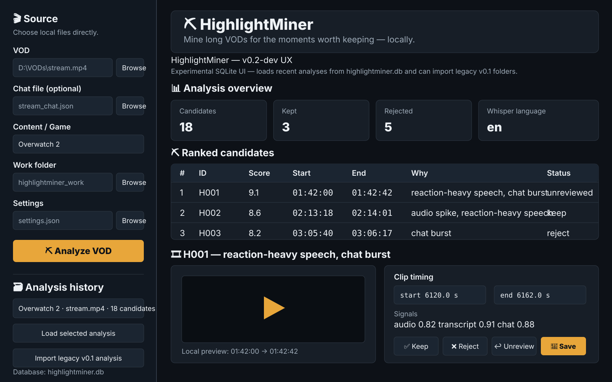

# ⛏️ HighlightMiner v0.2-dev

**Experimental local-first VOD highlight detection with persistent analysis history and future preference learning in mind.**

> **Development branch:** `v0.2-dev` — reports version `0.2.0.dev0`
>
> The stable/simple v0.1.x implementation remains on [`main`](https://github.com/jekku0966/HighlightMiner/tree/main). This branch is where the architecture gets sharper objects.

HighlightMiner analyzes long VODs using audio excitement, local Whisper transcription, reaction-heavy speech cues and optional chat bursts, then presents ranked candidate moments for human review.

## Current interface — `v0.2-dev`



This mockup represents the **current experimental UX implemented on `v0.2-dev`**. It uses the same Streamlit theme as `main`, but the sidebar/state model is intentionally different.

The development sidebar includes:

- VOD picker
- optional chat picker
- content/game label
- work folder
- settings file
- **Analyze VOD**
- **Analysis history** loaded from `highlightminer.db`
- **Load selected analysis**
- legacy v0.1 analysis import

The main review area still provides the familiar overview, ranked candidate table, lightweight preview, timing controls, Keep/Reject/Unreview actions, transcript/signal information, and export controls.

### Branch distinction

Unlike stable `main`, `v0.2-dev` **does not make the user hunt for `analysis.json` to reopen prior work**. Structured state lives in SQLite and recent analyses are surfaced directly in the sidebar.

Stable `main` remains file-based and uses an **Existing analysis** loader instead. Its UX mockup lives on the [`main` branch](https://github.com/jekku0966/HighlightMiner/tree/main).

The mockup is representative rather than pixel-for-pixel; Streamlit controls exact spacing and displayed rows/history depend on local data.

## What changed in v0.2

The major architectural change is persistent structured state in a **local SQLite database** instead of a pile of generated analysis/review JSON files.

```text
HighlightMiner/
├── HighlightMiner.exe / Python environment
├── settings.json
├── highlightminer.db
└── highlightminer_work/
    ├── .previews/
    └── clips/
```

The database stores:

- analysis metadata and source VOD path;
- content/game category;
- candidate rank and original signal scores;
- transcript segments and reaction scores;
- audio-energy/onset features;
- chat-burst features;
- Keep / Reject / Unreviewed state;
- user-adjusted start/end timing and clip title;
- export timestamps and exported paths.

Rejected candidates remain useful data rather than being thrown into the void. That is the foundation for later preference learning from real user decisions.

## v0.2 UI flow

1. **Source sidebar** — choose local VOD, optional chat, content/game label, work folder and settings.
2. **Analyze VOD** — local extraction, transcription, signal analysis and candidate ranking.
3. **Analysis history** — recent analyses are listed directly from `highlightminer.db`; there is no need to browse manually to `analysis.json`.
4. **Legacy import** — existing v0.1 analysis folders can be migrated into SQLite.
5. **Analysis overview** — candidate, kept/rejected and Whisper-language metrics.
6. **Ranked candidates** — score, timing, reason and review state.
7. **Candidate preview** — lightweight local preview clip instead of handing the full source VOD to the browser player.
8. **Review** — Keep, Reject, Unreview, retime and title.
9. **Export** — render kept clips and record export metadata in the database.

## Analysis pipeline

```text
VOD + optional chat
        │
        ├── FFmpeg audio extraction
        ├── faster-whisper transcription
        ├── audio excitement / onset scan
        └── chat velocity / burst scan
                    │
                    ▼
              signal fusion
                    │
                    ▼
          ranked candidate moments
                    │
                    ▼
              SQLite storage
                    │
                    ▼
          Streamlit review / export
```

## v0.2 development goals

The branch is designed to make these later features practical:

- learn from Keep/Reject/export decisions;
- rerank candidates using personal history;
- keep category/game context with each candidate;
- reduce durable generated-file clutter;
- maintain a real local history instead of isolated analysis folders;
- improve validation and packaged-app security before broader distribution.

For architecture/status notes, see [`V0.2_DEV.md`](V0.2_DEV.md).

## Security hardening in this branch

Current development work includes:

- local source-file validation;
- UNC/network-path rejection for source media;
- extension and size validation for chat/settings files;
- recursive chat JSON nesting limits;
- strict numeric setting/weight ranges;
- standard Whisper-model allow-list by default;
- explicit opt-in for custom model repositories;
- loopback-only Streamlit server configuration;
- pinned GitHub Actions revisions;
- SHA-256 sums for packaged Windows release artifacts;
- documented local-app threat model in [`SECURITY.md`](SECURITY.md).

## Recommended Twitch test workflow

For reproducible Twitch testing, use [TwitchDownloader](https://github.com/lay295/TwitchDownloader) to obtain a matching VOD and JSON chat export:

```text
TwitchDownloader
├── stream.mp4
└── stream_chat.json
        │
        ▼
   HighlightMiner
```

TwitchDownloader is not bundled or imported by HighlightMiner.

## Requirements

- Python **3.10+**
- FFmpeg + ffprobe
- Windows convenience/build scripts are included
- NVIDIA GPU optional but useful for larger Whisper models

Detailed docs:

- [`BUILD_WINDOWS.md`](BUILD_WINDOWS.md)
- [`CUDA_SETUP.md`](CUDA_SETUP.md)
- [`SECURITY.md`](SECURITY.md)

## Running the development branch

Clone and switch branches:

```powershell
git clone https://github.com/jekku0966/HighlightMiner.git
cd HighlightMiner
git switch v0.2-dev
```

Provide matching `ffmpeg` and `ffprobe` binaries under `./bin`, the project root, or system `PATH`.

Install:

```powershell
Set-ExecutionPolicy -Scope Process Bypass
.\setup.ps1
```

Check the environment:

```powershell
.\.venv\Scripts\python.exe -m highlightminer doctor
```

Launch:

```powershell
.\run.bat
```

## CLI

Analyze a VOD:

```powershell
.\.venv\Scripts\python.exe -m highlightminer analyze "D:\VODs\stream.mp4" --work-dir ".\highlightminer_work"
```

Analyze with chat and content label:

```powershell
.\.venv\Scripts\python.exe -m highlightminer analyze "D:\VODs\stream.mp4" `
  --chat "D:\VODs\stream_chat.json" `
  --content "Overwatch 2" `
  --work-dir ".\highlightminer_work"
```

Launch the UI:

```powershell
.\.venv\Scripts\python.exe -m highlightminer ui
```

The exact CLI surface is under active development; use `--help` on the branch as the source of truth when commands move.

## Legacy v0.1 import

The sidebar includes an **Import v0.1 analysis.json** expander. Existing v0.1 structured data is migrated when present, including review state and associated feature/transcript data.

This lets existing test history survive the storage migration instead of being ceremonially launched into the sun.

## File-count reduction

New v0.2 analyses do not need durable copies of the v0.1 structured artifacts:

```text
analysis.json
review.json
transcript.json
transcript_meta.json
audio_features.json
chat_features.json
```

The temporary 16 kHz analysis WAV is also removed after its useful data is committed. Large media, preview clips and final exports remain normal files.

## Current theme

The Streamlit theme is defined in `.streamlit/config.toml`.

| Role | Color |
|---|---|
| Primary action | `#E8A63A` |
| Main background | `#0D1117` |
| Main secondary surface | `#171E27` |
| Sidebar background | `#111821` |
| Sidebar secondary surface | `#1B2531` |
| Main text | `#EEF2F6` |
| Link/accent | `#F2B84B` |
| Border | `#303A46` |

The development UI intentionally stays close to native Streamlit components rather than burying the app under a giant custom-CSS theme that breaks the moment Streamlit sneezes.

## Testing

Install development dependencies:

```powershell
.\.venv\Scripts\python.exe -m pip install -e ".[dev]"
```

Run:

```powershell
.\.venv\Scripts\python.exe -m pytest -q
```

Before v0.2 replaces stable v0.1.x, the branch still needs real-world validation across database migration, packaged Windows builds, real VOD analysis, review, export and eventual learning behavior.

## Provenance and dependencies

HighlightMiner uses documented public interfaces from:

- [faster-whisper](https://github.com/SYSTRAN/faster-whisper)
- [CTranslate2](https://github.com/OpenNMT/CTranslate2)
- [FFmpeg](https://ffmpeg.org/)
- [Streamlit](https://streamlit.io/)
- [TwitchDownloader](https://github.com/lay295/TwitchDownloader) as a recommended input companion

The project has been developed with AI coding assistance from OpenAI's ChatGPT. See [`ATTRIBUTIONS.md`](ATTRIBUTIONS.md) for the detailed provenance policy.

## More documentation

- [`V0.2_DEV.md`](V0.2_DEV.md) — architecture/status notes for this branch
- [`BUILD_WINDOWS.md`](BUILD_WINDOWS.md) — Windows build/package notes
- [`CUDA_SETUP.md`](CUDA_SETUP.md) — CUDA/CTranslate2 setup
- [`SECURITY.md`](SECURITY.md) — threat model and security notes
- [`CHANGELOG.md`](CHANGELOG.md) — project changes
- [`CONTRIBUTING.md`](CONTRIBUTING.md) — contribution guidelines
- [`ATTRIBUTIONS.md`](ATTRIBUTIONS.md) — dependencies and provenance

## Stable release

If you want the simpler currently stable implementation rather than the experimental database architecture:

```powershell
git switch main
```

Or use the repository's published stable release assets.

## License

HighlightMiner's own source code is released under the **MIT License**. Third-party software, models and dependencies retain their own licenses.
