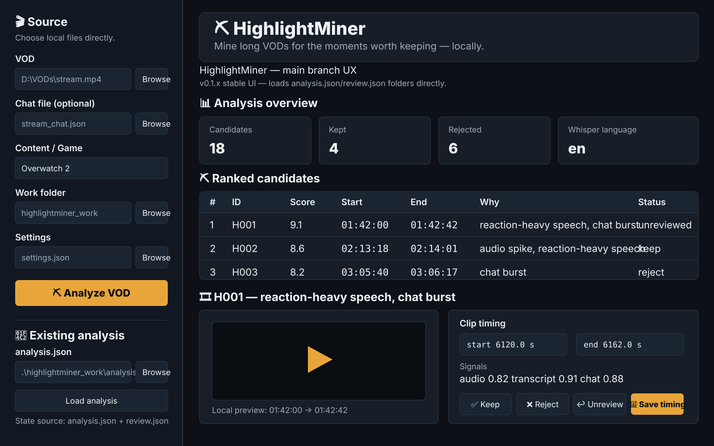

# ⛏️ HighlightMiner

**Local-first VOD highlight detection for streamers and long-form recordings.**

HighlightMiner scans long VODs for moments worth reviewing. It combines audio excitement, local Whisper transcription, reaction-heavy speech cues, and optional chat bursts into a ranked candidate list. You keep the good ones, reject the garbage, adjust the timing, and export clips locally.

> **Stable branch:** `main` — v0.1.x
>
> HighlightMiner is a candidate finder, not an omniscient comedy detector. Human taste remains inconveniently necessary.

## Current interface — `main`



This mockup represents the **stable file-based UX implemented on `main`**. It follows the repository's current Streamlit theme and layout rather than inventing a separate concept UI.

The stable sidebar works directly with local files and folders:

- VOD picker
- optional chat picker
- content/game label
- work folder
- settings file
- **Analyze VOD**
- **Existing analysis** loader for `analysis.json`

The main review area shows the analysis overview, ranked candidates, local preview, timing controls, Keep/Reject/Unreview actions, transcript/signal information, and export controls.

### Branch distinction

`main` is deliberately simple and folder-driven. Analysis/review state is stored in generated files such as `analysis.json` and `review.json`.

The experimental [`v0.2-dev`](https://github.com/jekku0966/HighlightMiner/tree/v0.2-dev) branch keeps the same visual language but replaces the **Existing analysis** section with **Analysis history** backed by `highlightminer.db`, plus legacy v0.1 import.

The mockup is representative rather than pixel-for-pixel; Streamlit controls exact spacing and the displayed rows depend on local data.

## What it does

```text
VOD + optional chat
        │
        ├── FFmpeg audio extraction
        ├── faster-whisper transcription
        ├── audio excitement / onset scan
        └── chat velocity / burst scan
                    │
                    ▼
              signal fusion
                    │
                    ▼
          ranked candidate moments
                    │
                    ▼
          local Streamlit review UI
                    │
          Keep / Reject / retime
                    │
                    ▼
              FFmpeg export
```

No cloud API is required for the stable v0.1.x workflow.

## Highlights

- **Local-first processing** — source VODs are read from disk rather than uploaded through the browser.
- **GPU Whisper support** — `faster-whisper`/CTranslate2 uses CUDA when available and falls back to CPU.
- **Optional chat scoring** — JSON, JSONL/NDJSON, and CSV inputs are supported.
- **Signal fusion** — audio, transcript and chat cues reinforce one another instead of generating separate clip lists.
- **Context windows** — candidates include pre-roll and post-roll so clips do not begin after the joke already happened.
- **Human review** — Keep, Reject, Unreview, retime, title, and preview candidate clips.
- **Accurate export** — final clips are re-encoded for more reliable arbitrary start/end points.
- **NVENC-first export** — attempts `h264_nvenc` and falls back to `libx264` when necessary.
- **Portable FFmpeg lookup** — `./bin`, project root, or system `PATH`.
- **Transparent provenance** — dependencies, external interfaces and AI-assisted development are documented in [`ATTRIBUTIONS.md`](ATTRIBUTIONS.md).

## Stable UI flow

1. **Source sidebar** — choose the VOD, optional chat file, content/game label, work folder and settings file.
2. **Analyze VOD** — extraction, transcription, signal analysis and ranking run locally.
3. **Existing analysis** — optionally browse back to an existing `analysis.json` from a prior run.
4. **Analysis overview** — candidate, kept/rejected and detected-language counts.
5. **Ranked candidates** — score, time range, detection reason and review state.
6. **Candidate review** — lightweight local preview, editable start/end, title and signal scores.
7. **Keep / Reject / Unreview** — save the human decision to the file-based review state.
8. **Export** — render all kept clips to the selected output folder.

## Recommended Twitch test workflow

For Twitch VODs, the recommended current testing workflow is to use [TwitchDownloader](https://github.com/lay295/TwitchDownloader) to obtain both the VOD and its matching JSON chat export:

```text
TwitchDownloader
├── stream.mp4
└── stream_chat.json
        │
        ▼
   HighlightMiner
```

HighlightMiner does **not** bundle, import or automatically invoke TwitchDownloader. It is a recommended companion/input baseline while the project is young.

## Requirements

- Python **3.10+**
- FFmpeg + ffprobe
- Windows convenience scripts are included; the Python project itself is not intentionally Windows-only
- NVIDIA GPU optional but strongly useful for large Whisper models

Detailed setup docs:

- [`BUILD_WINDOWS.md`](BUILD_WINDOWS.md)
- [`CUDA_SETUP.md`](CUDA_SETUP.md)

## Quick start — Windows

### 1. Clone

```powershell
git clone https://github.com/jekku0966/HighlightMiner.git
cd HighlightMiner
```

### 2. Provide FFmpeg

Put matching `ffmpeg` and `ffprobe` executables in either:

```text
HighlightMiner/bin/
```

or the project root, or install them on the system `PATH`.

### 3. Install

```powershell
Set-ExecutionPolicy -Scope Process Bypass
.\setup.ps1
```

### 4. Check the environment

```powershell
.\.venv\Scripts\python.exe -m highlightminer doctor
```

### 5. Launch

```powershell
.\run.bat
```

Then choose a VOD, optional matching chat export, work folder and settings file, and click **Analyze VOD**.

## CLI

Analyze a VOD:

```powershell
.\.venv\Scripts\python.exe -m highlightminer analyze "D:\VODs\stream.mp4" --work-dir ".\highlightminer_work\stream-001"
```

Analyze with chat:

```powershell
.\.venv\Scripts\python.exe -m highlightminer analyze "D:\VODs\stream.mp4" `
  --chat "D:\VODs\stream_chat.json" `
  --work-dir ".\highlightminer_work\stream-001"
```

Launch the UI:

```powershell
.\.venv\Scripts\python.exe -m highlightminer ui
```

Export clips marked **Keep**:

```powershell
.\.venv\Scripts\python.exe -m highlightminer export ".\highlightminer_work\stream-001\analysis.json"
```

## Stable v0.1.x work directory

```text
highlightminer_work/stream-001/
├── analysis_audio.wav
├── audio_features.json
├── transcript.json
├── transcript_meta.json
├── chat_features.json       # when chat is supplied
├── analysis.json
├── review.json
└── clips/
```

The expensive transcription/features can be reused when reopening an existing analysis.

## Chat input

Supported containers:

- JSON
- JSONL / NDJSON
- CSV

Common timestamp fields include:

```text
content_offset_seconds
video_offset
offset_seconds
timestamp_seconds
seconds
timestamp
time
offset
```

Common message fields include `body`, `message`, `text`, and `content`.

Minimal CSV:

```csv
timestamp,message
12.4,LUL
12.8,WHAT
13.0,NO WAY
```

## Tuning

Edit `settings.json`.

| Setting | Purpose |
|---|---|
| `whisper_model` | Whisper model used for transcription |
| `device` | `auto`, `cuda`, or `cpu` |
| `compute_type` | CTranslate2 compute type |
| `language` | Force a language or use automatic detection |
| `pre_roll_sec` | Context before a detected moment |
| `post_roll_sec` | Context after a detected moment |
| `merge_gap_sec` | Merge nearby spikes into one candidate |
| `max_candidate_sec` | Maximum suggested clip duration |
| `min_candidate_score` | Main candidate threshold |
| `max_candidates` | Review-queue cap |
| `weights` | Relative audio/transcript/chat contribution |
| `reaction_phrases` | User-configurable reaction phrases |

A good rule: tune across several different VODs, not one carefully overfitted disaster.

## v0.2 development branch

Active architecture work lives on [`v0.2-dev`](https://github.com/jekku0966/HighlightMiner/tree/v0.2-dev).

The development branch moves structured analysis/review state into SQLite, adds analysis history and legacy import, strengthens validation/security, and lays the foundation for learning from Keep/Reject decisions.

See [`V0.2_DEV.md`](https://github.com/jekku0966/HighlightMiner/blob/v0.2-dev/V0.2_DEV.md) for the current development notes.

## Limitations

The stable version does **not** currently:

- understand gameplay visually;
- know whether a joke is actually funny;
- identify game-specific kills/wins/deaths from the UI;
- automatically learn your taste yet;
- download Twitch/YouTube VODs itself;
- publish clips to social platforms.

Treat the ranking as **where should I look first?**, not **the machine has discovered comedy**.

## Provenance and dependencies

HighlightMiner's application-specific implementation was written for this project. It uses documented public interfaces from projects including:

- [faster-whisper](https://github.com/SYSTRAN/faster-whisper)
- [CTranslate2](https://github.com/OpenNMT/CTranslate2)
- [FFmpeg](https://ffmpeg.org/)
- [Streamlit](https://streamlit.io/)
- [TwitchDownloader](https://github.com/lay295/TwitchDownloader) as a recommended input companion, not a runtime dependency

The project was developed with AI coding assistance from OpenAI's ChatGPT. See [`ATTRIBUTIONS.md`](ATTRIBUTIONS.md) for the detailed provenance policy.

## Testing

```powershell
.\.venv\Scripts\python.exe -m pip install -e ".[dev]"
.\.venv\Scripts\python.exe -m pytest -q
```

GitHub Actions runs the test suite on pushes and pull requests.

## More documentation

- [`BUILD_WINDOWS.md`](BUILD_WINDOWS.md) — Windows packaging/build notes
- [`CUDA_SETUP.md`](CUDA_SETUP.md) — CUDA/CTranslate2 setup
- [`CHANGELOG.md`](CHANGELOG.md) — project changes
- [`RELEASE_NOTES_v0.1.2.md`](RELEASE_NOTES_v0.1.2.md) — stable release notes
- [`SECURITY.md`](SECURITY.md) — security notes
- [`CONTRIBUTING.md`](CONTRIBUTING.md) — contribution guidelines
- [`ATTRIBUTIONS.md`](ATTRIBUTIONS.md) — dependencies and provenance

## License

HighlightMiner's own source code is released under the **MIT License**. Third-party software, models and dependencies retain their own licenses.
