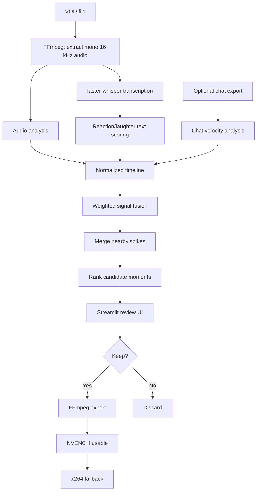

# ⛏️ HighlightMiner

**Local-first VOD highlight detection for streamers and long-form recordings.**

HighlightMiner scans a VOD, combines audio spikes, speech/reaction cues, and optional chat bursts, then produces a ranked review queue. You decide what is actually worth keeping and export the selected moments as MP4 clips.

> **Status:** early MVP / v0.1.0. Useful, hackable, and intentionally simple. It is not yet a full gameplay-understanding AI editor.

## Why this exists

Manually scrubbing a multi-hour stream to find the 30 seconds where everything went spectacularly wrong is a terrible use of a human lifespan.

HighlightMiner does the cheap work first:

1. Extract low-cost audio features.
2. Transcribe speech locally with `faster-whisper`.
3. Score reaction-heavy transcript segments.
4. Optionally measure chat-message bursts.
5. Merge those signals into candidate highlight windows.
6. Let a human review the ranked list in a local browser UI.
7. Export only the clips you mark **Keep**.

No cloud API is required for v0.1.

---

## Features

- **Local VOD analysis** — your video is processed on your own machine.
- **GPU Whisper support** — uses `faster-whisper`/CTranslate2 when CUDA is available, with CPU fallback.
- **Audio excitement scoring** — finds unusually loud/energetic moments and sudden changes.
- **Transcript heuristics** — reactions, laughter, profanity, emphatic wording, and configurable phrases.
- **Optional chat-burst scoring** — JSON, JSONL/NDJSON, or CSV.
- **Signal fusion** — audio + transcript + chat are weighted rather than treated as independent clip generators.
- **Context-aware candidate windows** — pre-roll/post-roll keeps the setup before the punchline.
- **Local Streamlit review UI** — preview, Keep/Reject, adjust timing, and title clips.
- **Accurate clip export** — re-encodes selected clips rather than depending on stream-copy keyframes.
- **NVENC-first export** — attempts `h264_nvenc` when available and falls back to `libx264`.
- **Cached analysis artifacts** — expensive transcription is reused when possible.

---

## How it works



### Default score weighting

From `settings.json`:

```json
{
  "weights": {
    "audio": 0.34,
    "transcript": 0.42,
    "chat": 0.24
  }
}
```

If no chat file is supplied, the remaining weights are automatically renormalized.

The score is **not** meant to answer “is this objectively funny?” — thankfully we have not yet invented that particular dystopia. It ranks moments that *look promising* so a human can review far less footage.

---

## Requirements

### Required

- Windows, Linux, or macOS should work in principle; the included convenience scripts target Windows.
- Python **3.10+**
- FFmpeg and ffprobe available on `PATH`

Check:

```powershell
ffmpeg -version
ffprobe -version
python --version
```

### NVIDIA GPU transcription

The project uses `faster-whisper`, which uses CTranslate2. Current `faster-whisper` documentation states that current CTranslate2 GPU builds require CUDA 12 libraries and cuDNN 9. If CTranslate2 cannot initialize CUDA, HighlightMiner falls back to CPU INT8 transcription.

The first time a model name such as `large-v3` is loaded, `faster-whisper` can download the corresponding CTranslate2 model from Hugging Face Hub.

See the upstream documentation in [Sources, dependencies, and provenance](#sources-dependencies-and-provenance).

---

## Quick start — Windows

### 1. Clone or download the repository

```powershell
git clone https://github.com/YOUR-USERNAME/HighlightMiner.git
cd HighlightMiner
```

Or download the repository ZIP from GitHub and extract it.

### 2. Create the environment and install HighlightMiner

```powershell
Set-ExecutionPolicy -Scope Process Bypass
.\setup.ps1
```

### 3. Check the installation

```powershell
.\.venv\Scripts\python.exe -m highlightminer doctor
```

The doctor reports:

- Python version
- FFmpeg / ffprobe availability
- whether FFmpeg exposes `h264_nvenc`
- CTranslate2 version
- CUDA devices visible to CTranslate2
- faster-whisper import status

### 4. Launch the review app

```powershell
.\run.bat
```

Then enter:

- **VOD path** — local `.mp4`, `.mkv`, etc. readable by FFmpeg
- **Chat file** — optional JSON / JSONL / NDJSON / CSV
- **Work folder** — where analysis artifacts should be cached
- **Settings** — normally leave this pointing at `settings.json`

Click **Analyze VOD**.

---

## Publish this folder to GitHub

Create an **empty** repository on GitHub. Because this project already contains a README, `.gitignore`, and license, do not ask GitHub to generate those files for the new repository.

From PowerShell inside the HighlightMiner folder:

```powershell
git init
git add .
git commit -m "Initial HighlightMiner v0.1.0"
git branch -M main
git remote add origin https://github.com/YOUR-USERNAME/HighlightMiner.git
git push -u origin main
```

After pushing, replace `YOUR-USERNAME` in the clone example above with your actual GitHub username.

Before the first push, `git status` should **not** show VODs, WAV analysis files, exported clips, virtual environments, or Python cache files because those are ignored by `.gitignore`.

---

## CLI usage

### Analyze a VOD

```powershell
.\.venv\Scripts\python.exe -m highlightminer analyze "D:\VODs\stream.mp4" --work-dir ".\highlightminer_work\stream-001"
```

### Analyze with chat

```powershell
.\.venv\Scripts\python.exe -m highlightminer analyze "D:\VODs\stream.mp4" `
  --chat "D:\VODs\stream_chat.json" `
  --work-dir ".\highlightminer_work\stream-001"
```

### Launch the UI

```powershell
.\.venv\Scripts\python.exe -m highlightminer ui
```

### Export clips marked Keep

```powershell
.\.venv\Scripts\python.exe -m highlightminer export ".\highlightminer_work\stream-001\analysis.json"
```

### Export every ranked candidate

```powershell
.\.venv\Scripts\python.exe -m highlightminer export ".\highlightminer_work\stream-001\analysis.json" --all
```

---

## Review workflow

Each candidate contains:

- rank and score
- suggested start/end time
- peak timestamp
- reason(s) it was detected
- audio score
- transcript score
- chat score
- nearby transcript text

In the UI you can:

- **Keep** a candidate
- **Reject** it
- return it to **Unreviewed**
- adjust the start/end timestamps
- add a filename-friendly clip title
- export all kept clips

The review state is persisted separately in `review.json`, so rerunning the UI does not destroy your decisions.

---

## Work directory

A typical analysis directory looks like this:

```text
highlightminer_work/stream-001/
├── analysis_audio.wav
├── audio_features.json
├── transcript.json
├── transcript_meta.json
├── chat_features.json       # only when chat is supplied
├── analysis.json
├── review.json
└── clips/
    ├── H001_example_title.mp4
    └── H004.mp4
```

### What each file is for

| File | Purpose |
|---|---|
| `analysis_audio.wav` | Mono 16 kHz PCM audio used for analysis/transcription |
| `audio_features.json` | Timestamped audio-energy/onset features |
| `transcript.json` | Timestamped Whisper segments + per-segment text score |
| `transcript_meta.json` | Model, language, device, and compute metadata |
| `chat_features.json` | Timestamped chat-velocity features |
| `analysis.json` | Ranked highlight candidates |
| `review.json` | Human Keep/Reject/timing/title edits |
| `clips/` | Exported videos |

---

## Chat input

The parser intentionally accepts several common layouts instead of depending on a single chat-export tool.

Supported containers:

- JSON
- JSONL / NDJSON
- CSV

Recognized timestamp field names include:

```text
content_offset_seconds
offset_seconds
timestamp_seconds
timestamp
time
offset
```

Recognized message field names include:

```text
body
message
text
content
```

Minimal CSV example:

```csv
timestamp,message
12.4,LUL
12.8,WHAT
13.0,NO WAY
```

The loose JSON parser was designed to be compatible with common Twitch-style exports, including TwitchDownloader-like JSON structures, but **HighlightMiner contains no TwitchDownloader source code**.

---

## Tuning

Edit `settings.json`.

Important knobs:

| Setting | Effect |
|---|---|
| `whisper_model` | faster-whisper model to load |
| `device` | `auto`, `cuda`, or `cpu` |
| `compute_type` | CTranslate2 compute type |
| `language` | Force a Whisper language or leave `null` for detection |
| `beam_size` | Whisper beam search size |
| `pre_roll_sec` | Context before an event |
| `post_roll_sec` | Context after an event |
| `merge_gap_sec` | Merge nearby signal spikes |
| `max_candidate_sec` | Maximum suggested clip length |
| `min_candidate_score` | Main candidate threshold |
| `max_candidates` | Maximum items in review queue |
| `weights` | Audio/transcript/chat contribution |
| `reaction_phrases` | Custom phrases that should raise transcript scores |

### Practical tuning approach

Do **not** tune until one VOD looks perfect. That is just overfitting with extra steps.

Instead:

1. Process several different streams.
2. Note false positives and missed moments.
3. Adjust one or two settings at a time.
4. Re-run ranking and compare.
5. Eventually use Keep/Reject decisions as training data for a personalized classifier.

---

## Why final clips are re-encoded

FFmpeg stream copy (`-c copy`) is extremely fast and avoids generation loss, but accurate arbitrary cuts can be constrained by the source stream's keyframes/timestamps. HighlightMiner therefore re-encodes selected clips so the reviewed start/end window is respected more consistently.

Export order:

1. Try `h264_nvenc` with CQ-based settings if FFmpeg reports the encoder.
2. If NVENC invocation fails — for example because FFmpeg was built with NVENC but no usable NVIDIA device/driver is present — delete the partial output.
3. Retry with `libx264` CRF 18.
4. Encode audio as AAC 192 kbit/s and use `+faststart` for convenient playback.

---

## Source tree

```text
HighlightMiner/
├── .github/
│   └── workflows/
│       └── tests.yml
├── highlightminer/
│   ├── app.py          # Streamlit review UI
│   ├── audio.py        # WAV feature extraction
│   ├── chat.py         # Chat parsing and burst scoring
│   ├── cli.py          # CLI entry points
│   ├── config.py       # Settings model
│   ├── doctor.py       # Environment diagnostics
│   ├── export.py       # Accurate MP4 clip export
│   ├── media.py        # ffmpeg / ffprobe helpers
│   ├── pipeline.py     # End-to-end analysis orchestration
│   ├── review.py       # Human-review persistence
│   ├── scoring.py      # Signal fusion and candidate generation
│   ├── transcribe.py   # faster-whisper integration + text heuristics
│   └── util.py
├── tests/
├── ATTRIBUTIONS.md
├── CHANGELOG.md
├── CONTRIBUTING.md
├── LICENSE
├── README.md
├── pyproject.toml
├── run.bat
├── settings.json
└── setup.ps1
```

---

## Sources, dependencies, and provenance

This section is intentionally explicit because AI-assisted/vibe-coded projects should not pretend code appeared from the sacred void.

### What was copied?

**No complete source file and no substantial code block in HighlightMiner was copied verbatim from another repository.** The application-specific implementation — audio feature extraction, chat normalization/scoring, transcript heuristics, timeline fusion, candidate merging/ranking, review-state format, orchestration, and fallback behavior — was written for HighlightMiner.

The project **does** call public APIs/CLIs from third-party software. Those interfaces were implemented with reference to their official documentation:

#### faster-whisper / CTranslate2

Used for local speech-to-text. `highlightminer/transcribe.py` follows the public `WhisperModel(...)` and `model.transcribe(...)` API shape documented by faster-whisper, including `beam_size`, `vad_filter`, CUDA/CPU device selection, and segment iteration.

- Repository/docs: https://github.com/SYSTRAN/faster-whisper
- License: MIT
- CTranslate2: https://github.com/OpenNMT/CTranslate2

The upstream README documents the current CUDA/cuDNN requirements and states that named models such as `large-v3` can be downloaded automatically from Hugging Face Hub.

#### FFmpeg / ffprobe

Used by `highlightminer/media.py` and `highlightminer/export.py` for media probing, audio extraction, and final clip encoding. Commands were assembled from standard documented FFmpeg CLI options; no FFmpeg source code is embedded in this repository.

- Project: https://ffmpeg.org/
- Documentation: https://ffmpeg.org/ffmpeg.html
- Full docs: https://ffmpeg.org/ffmpeg-all.html

FFmpeg is an external executable and has its own licensing/build configuration. Installing HighlightMiner does not redistribute FFmpeg.

#### Streamlit

Used only as the local review UI. `highlightminer/app.py` uses Streamlit's public widgets and media APIs such as `st.video`, inputs, tables, status/progress elements, and session state.

- Documentation: https://docs.streamlit.io/
- `st.video`: https://docs.streamlit.io/develop/api-reference/media/st.video
- Repository: https://github.com/streamlit/streamlit

#### TwitchDownloader

TwitchDownloader is **not a dependency** and no TwitchDownloader code is bundled. It is referenced because it is a common way to export Twitch VOD chat as JSON, and HighlightMiner's permissive chat parser attempts to understand common timestamp/message fields seen in Twitch-style exports.

- Repository: https://github.com/lay295/TwitchDownloader
- License: MIT

### Python dependencies

Declared in `pyproject.toml`:

- `numpy`
- `faster-whisper`
- `streamlit`

These packages and their transitive dependencies retain their own licenses. See [`ATTRIBUTIONS.md`](ATTRIBUTIONS.md) for the project-level dependency/provenance notes.

### AI assistance

The initial HighlightMiner v0.1 implementation and documentation were developed with AI coding assistance in conversation with OpenAI's ChatGPT. The project was then exercised with unit/synthetic media tests during development. AI assistance does **not** change the licenses of third-party dependencies, and generated code should still be reviewed like any other code before production use.

---

## Testing

Install the development extra:

```powershell
.\.venv\Scripts\python.exe -m pip install -e ".[dev]"
```

Run:

```powershell
.\.venv\Scripts\python.exe -m pytest -q
```

Current tests cover:

- transcript reaction scoring
- chat-burst detection
- candidate creation around a signal spike

GitHub Actions runs the test suite on pushes and pull requests.

---

## Limitations

v0.1 currently does **not**:

- understand gameplay or visual jokes
- detect kills/wins/deaths from a game's UI
- identify speaker emotion with a trained emotion model
- distinguish genuine laughter from every possible transcript representation
- automatically learn your taste yet
- download VODs or chat from Twitch/YouTube itself
- publish clips to social platforms

The tool should be treated as a **candidate finder**, not an omniscient editor.

---

## Roadmap

### v0.2 — learn from Keep/Reject

Persist feature vectors from review decisions and train a small classifier to predict which candidates you personally keep.

### v0.3 — multimodal second pass

Sample only the strongest candidate windows and send frames + transcript + signal metadata to a vision-language model. This keeps expensive visual analysis focused on minutes instead of hours.

### v0.4 — game/event adapters

Optional plugins for OCR, killfeed/scoreboard changes, scene transitions, or game telemetry where available.

### v0.5 — live mode

Analyze a rolling stream buffer and create candidate timestamps while streaming.

---

## Contributing

Bug reports, tests, new chat parsers, scoring ideas, and game-specific signal adapters are welcome. See [`CONTRIBUTING.md`](CONTRIBUTING.md).

Please keep external code provenance clear. If you adapt code from another project, document the source and ensure its license is compatible.

---

## License

HighlightMiner's own source code is released under the **MIT License**. See [`LICENSE`](LICENSE).

Third-party packages, models, and external executables are **not relicensed** by this repository. See [`ATTRIBUTIONS.md`](ATTRIBUTIONS.md).
